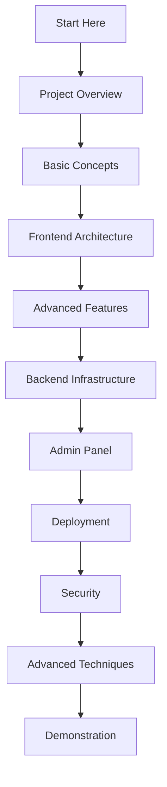

# BMCC Admission Form - Complete Project Presentation

> **A comprehensive guide from basics to advanced features**

---

## 📚 Table of Contents

### [[01_Project_Overview|🎯 Part 1: Project Overview]]
- What is BMCC Admission Form?
- Project Goals & Objectives
- Tech Stack Overview
- Live Demo URLs

### [[02_Basic_Concepts|📖 Part 2: Basic Concepts]]
- Understanding the Form Structure
- User Journey & Experience
- Form Validation Basics
- Data Collection Process

### [[03_Frontend_Architecture|🎨 Part 3: Frontend Architecture]]
- HTML Structure & Semantic Markup
- CSS Design System & Styling
- JavaScript Functionality
- Responsive Design Principles

### [[04_Advanced_Features|⚡ Part 4: Advanced Features]]
- Multi-Step Form Navigation
- Auto-Save & Progress Tracking
- Preview Mode & Testing
- File Upload Handling

### [[05_Backend_Infrastructure|☁️ Part 5: Backend Infrastructure]]
- Firebase Integration
- Realtime Database Setup
- Hybrid Mode (Offline/Online)
- Data Synchronization

### [[06_Admin_Panel|🔐 Part 6: Admin Panel]]
- Admin Dashboard Overview
- Authentication System
- Data Management Features
- Export Functionality (CSV/JSON)

### [[07_Deployment|🚀 Part 7: Deployment & Production]]
- GitHub Repository Setup
- Netlify Deployment Process
- Continuous Integration
- Domain Configuration

### [[08_Security_Best_Practices|🛡️ Part 8: Security & Best Practices]]
- Data Privacy Considerations
- Input Validation & Sanitization
- Admin Access Control
- Firebase Security Rules

### [[09_Advanced_Techniques|🧠 Part 9: Advanced Techniques]]
- Auto-Calculations (SSC/HSC %)
- Dynamic Form Fields
- Keyboard Navigation
- Performance Optimization

### [[10_Project_Demonstration|🎬 Part 10: Live Demonstration Guide]]
- How to Present the Project
- Key Features to Highlight
- Common Questions & Answers
- Future Enhancements

---

## 🔗 Quick Links

- **Live Form:** https://bmccadmissionform2024-25.netlify.app/
- **Admin Panel:** https://bmccadmissionform2024-25.netlify.app/admin.html
- **GitHub Repository:** https://github.com/ptusb/bmcc-admission-form
- **Firebase Console:** https://console.firebase.google.com/

---

## 📊 Project Statistics

- **Total Files:** 15+
- **Lines of Code:** 2,500+
- **Technologies Used:** 8
- **Development Time:** Optimized for rapid deployment
- **Deployment Status:** ✅ LIVE & ONLINE

---

## 🎯 Learning Path

---

**Created:** November 2024  
**Status:** Production Ready  
**Mode:** Online with Cloud Database  

**Start your journey:** [[01_Project_Overview|Begin with Project Overview →]]
