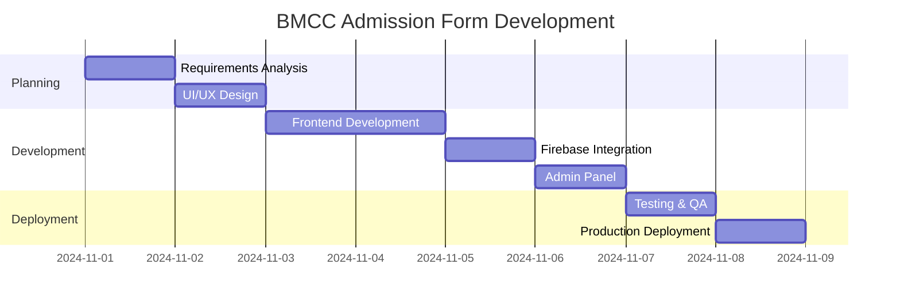

# Part 1: Project Overview 🎯

[[00_INDEX|← Back to Index]] | [[02_Basic_Concepts|Next: Basic Concepts →]]

---

## What is BMCC Admission Form?

The **BMCC (Brihan Maharashtra College of Commerce) Admission Form** is a modern, full-stack web application designed to streamline the student admission process for Deccan Education Society, Pune.

### 🎓 Purpose

- **Digitize** the traditional paper-based admission process
- **Simplify** data collection for students and administrators
- **Centralize** application management in the cloud
- **Enable** remote access from any device

---

## 🎯 Project Goals & Objectives

### Primary Goals

1. **User-Friendly Interface**
   - Clean, modern design
   - Step-by-step form navigation
   - Real-time validation
   - Mobile-responsive layout

2. **Data Management**
   - Secure cloud storage
   - Instant synchronization
   - Easy export capabilities
   - Search and filter options

3. **Administrative Control**
   - Dedicated admin panel
   - Password-protected access
   - Real-time statistics
   - Application tracking

### Success Criteria

✅ **100% Functional** - All features working  
✅ **Cloud Deployed** - Accessible globally  
✅ **Real-time Updates** - Instant data sync  
✅ **Secure** - Protected admin access  

---

## 🛠️ Tech Stack Overview

### Frontend
```
HTML5          - Semantic structure
CSS3           - Modern styling & animations
JavaScript ES6 - Dynamic functionality
```

### Backend
```
Firebase       - Cloud database & hosting
Realtime DB    - NoSQL data storage
Authentication - Secure access control
```

### Deployment
```
GitHub         - Version control
Netlify        - Continuous deployment
CDN            - Global content delivery
```

### Development Tools
```
Git            - Source code management
VS Code        - Code editor
Chrome DevTools - Debugging & testing
```

---

## 🌐 Live Demo URLs

### Public Form
**URL:** https://bmccadmissionform2024-25.netlify.app/

**Features:**
- Multi-step form (5 sections)
- Auto-save progress
- Preview mode for testing
- Responsive design

**Test it:**
1. Fill in personal details
2. Navigate between steps
3. Upload documents
4. Submit application

---

### Admin Panel
**URL:** https://bmccadmissionform2024-25.netlify.app/admin.html

**Credentials:**
```
Password: admin123
```

**Features:**
- Real-time dashboard
- Application statistics
- Search & filter
- Export to CSV/JSON
- View detailed applications
- Delete functionality

**Status Indicator:**
🟢 **ONLINE MODE** - Connected to Firebase Cloud

---

## 📊 Project Architecture

```
┌─────────────────────────────────────────────┐
│           USER INTERFACE (Frontend)         │
│  - Multi-step Form                          │
│  - Preview Mode                             │
│  - Validation & Auto-save                   │
└─────────────────┬───────────────────────────┘
                  │
                  ↓
┌─────────────────────────────────────────────┐
│         FIREBASE CLOUD (Backend)            │
│  - Realtime Database                        │
│  - Data Synchronization                     │
│  - Cloud Storage                            │
└─────────────────┬───────────────────────────┘
                  │
                  ↓
┌─────────────────────────────────────────────┐
│         ADMIN PANEL (Management)            │
│  - Dashboard & Statistics                   │
│  - Search & Export                          │
│  - Application Management                   │
└─────────────────────────────────────────────┘
```

---

## 🎨 Key Design Principles

### 1. **Progressive Enhancement**
Start with basic HTML, enhance with CSS, add JavaScript functionality

### 2. **Mobile-First Approach**
Design for small screens, scale up for larger devices

### 3. **User-Centric Design**
- Clear labels and instructions
- Helpful error messages
- Visual feedback for actions
- Keyboard navigation support

### 4. **Performance Optimization**
- Lazy loading images
- Minimal external dependencies
- Efficient code structure
- Fast page load times

---

## 📈 Project Timeline



---

## 🎯 Target Audience

### Primary Users
- **Students** applying for admission
- **Parents/Guardians** assisting with applications
- **Education Consultants** helping multiple students

### Administrative Users
- **Admission Officers** reviewing applications
- **College Administrators** managing data
- **IT Staff** maintaining the system

---

## 💡 Unique Selling Points

### 1. **Hybrid Mode**
Works offline (localStorage) and automatically upgrades to online (Firebase) when configured

### 2. **Zero Setup Required**
No installation needed - access via browser from anywhere

### 3. **Real-time Collaboration**
Multiple admins can view data simultaneously

### 4. **Cost-Effective**
Completely free to deploy and host using Firebase free tier + Netlify

### 5. **Professional Presentation**
Clean, modern UI that impresses stakeholders

---

## 📝 Project Structure

```
bmcc-admission-form/
│
├── index.html              # Main application form
├── admin.html             # Admin panel
├── style.css              # Main stylesheet
├── admin-style.css        # Admin panel styles
├── script.js              # Form functionality
├── admin-script.js        # Admin panel logic
├── firebase-config.js     # Firebase configuration
│
├── OBSIDIAN_PRESENTATION/ # This presentation folder
│   ├── 00_INDEX.md
│   ├── 01_Project_Overview.md
│   └── ...
│
├── assets/
│   └── logo.jpg           # College logo
│
└── README.md              # Project documentation
```

---

## 🎬 Next Steps

Now that you understand the project overview, let's dive into the **basic concepts** that make this application work!

[[02_Basic_Concepts|Continue to Part 2: Basic Concepts →]]

---

[[00_INDEX|← Back to Index]]
