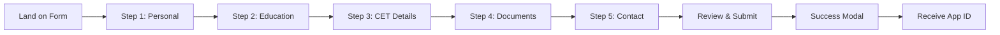
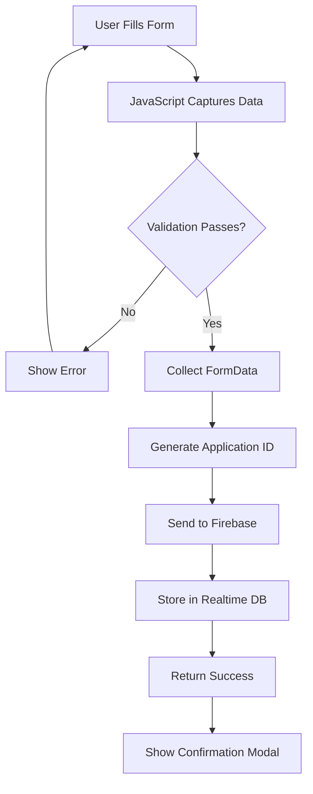

# Part 2: Basic Concepts 📖

[[01_Project_Overview|← Previous: Project Overview]] | [[00_INDEX|Index]] | [[03_Frontend_Architecture|Next: Frontend Architecture →]]

---

## Understanding the Form Structure

### 📋 Five Main Sections

The admission form is divided into **5 logical sections** to avoid overwhelming users:

#### **Section 1: Personal Information**
```
- Full Name
- Date of Birth (with auto-age calculation)
- Gender
- Category (General/SC/ST/OBC, etc.)
- Religion
- Nationality
```

**Why this matters:**
- Users see only relevant fields at a time
- Reduces cognitive load
- Improves completion rates

---

#### **Section 2: Educational Qualifications**

**SSC (10th Standard)**
```
- Board (Maharashtra/CBSE/ICSE)
- School Name
- Year of Passing
- Marks Obtained
- Total Marks
- Percentage (auto-calculated)
```

**HSC (12th Standard)**
```
- Board
- Stream (Science/Commerce/Arts)
- College Name
- Year of Passing
- Marks Obtained
- Total Marks
- Percentage (auto-calculated)
```

**Auto-Calculation Formula:**
```javascript
percentage = (marksObtained / totalMarks) × 100
```

---

#### **Section 3: CET Examination Details**

```
- Program Preference 1
- Program Preference 2
- CET Application ID
- CET Marks
- CET Percentile
- MH State Rank
- All India Rank
```

**Purpose:**
- Determines eligibility for programs
- Helps in merit-based admission
- Automates seat allocation planning

---

#### **Section 4: Required Documents**

**Document Categories:**

1. **Caste & Income Documents**
   - Caste Certificate (if applicable)
   - Non-Creamy Layer Certificate
   - Income Certificate

2. **Identity Documents**
   - Aadhar Card (mandatory)
   - PAN Card
   - Passport Size Photo

3. **Educational Documents**
   - SSC Mark Sheet
   - HSC Mark Sheet
   - Leaving Certificate
   - Gap Certificate (if applicable)

**File Upload Process:**
```
1. Click "Choose file" or drag & drop
2. File name displays on selection
3. Validation: Max 5MB per file
4. Accepts: PDF, JPG, PNG formats
```

---

#### **Section 5: Bank Details & Contact**

**Bank Information:**
```
- Bank Name
- Account Number
- IFSC Code (auto-formatted to uppercase)
- Branch Name
```

**Contact Details:**
```
- Email (validated format)
- Mobile Number (10 digits, auto-formatted)
- Alternate Mobile
- Address (Complete)
- City
- State
- Pincode (6 digits)
```

**Parent/Guardian Info:**
```
- Name
- Relationship
- Occupation
- Mobile Number
```

**Admission Source:**
```
- How did you hear about us?
  (Website, Social Media, Friends, etc.)
```

---

## 👤 User Journey & Experience

### Step-by-Step Flow



### Progressive Disclosure

**Concept:** Show only what's needed at each step

**Benefits:**
- ✅ Reduces form abandonment
- ✅ Improves focus and accuracy
- ✅ Better mobile experience
- ✅ Psychological progress motivation

**Implementation:**
```css
.form-step {
    display: none;  /* Hide all steps */
}

.form-step.active {
    display: block;  /* Show only active step */
}
```

---

## ✅ Form Validation Basics

### Client-Side Validation

#### 1. **Required Field Validation**

```javascript
// Check if field is empty
if (!field.value.trim()) {
    showError("This field is required");
    return false;
}
```

**Visual Feedback:**
- ❌ Red border for invalid fields
- ✅ Green border for valid fields
- 📝 Error message below field

---

#### 2. **Email Validation**

```javascript
const emailPattern = /^[^\s@]+@[^\s@]+\.[^\s@]+$/;

if (!emailPattern.test(email)) {
    showError("Please enter a valid email");
    return false;
}
```

**Example:**
- ✅ Valid: `student@gmail.com`
- ❌ Invalid: `student@gmailcom`

---

#### 3. **Mobile Number Validation**

```javascript
const mobilePattern = /^[6-9]\d{9}$/;

if (!mobilePattern.test(mobile)) {
    showError("Enter valid 10-digit mobile");
    return false;
}
```

**Rules:**
- Must start with 6, 7, 8, or 9
- Exactly 10 digits
- No spaces or special characters

---

#### 4. **Date of Birth Validation**

```javascript
const age = calculateAge(dob);

if (age < 16) {
    showError("Applicant must be at least 16 years old");
    return false;
}
```

**Auto-Age Calculation:**
```javascript
function calculateAge(birthDate) {
    const today = new Date();
    const birth = new Date(birthDate);
    let age = today.getFullYear() - birth.getFullYear();
    const monthDiff = today.getMonth() - birth.getMonth();
    
    if (monthDiff < 0 || (monthDiff === 0 && today.getDate() < birth.getDate())) {
        age--;
    }
    
    return age;
}
```

---

#### 5. **File Upload Validation**

```javascript
const allowedTypes = ['image/jpeg', 'image/png', 'application/pdf'];
const maxSize = 5 * 1024 * 1024; // 5MB

if (!allowedTypes.includes(file.type)) {
    showError("Only JPG, PNG, PDF allowed");
    return false;
}

if (file.size > maxSize) {
    showError("File size must be less than 5MB");
    return false;
}
```

---

### Server-Side Validation (Future Enhancement)

While we currently use Firebase's real-time database which doesn't have traditional "server-side" validation, we can implement **Firebase Security Rules**:

```json
{
  "rules": {
    "applications": {
      ".write": "newData.child('email').val().matches(/^[^\s@]+@[^\s@]+\.[^\s@]+$/)",
      ".validate": "newData.hasChildren(['fullName', 'email', 'mobile'])"
    }
  }
}
```

---

## 💾 Data Collection Process

### How Data Flows



---

### Data Collection Code

```javascript
function handleFormSubmit(e) {
    e.preventDefault();
    
    // 1. Validate current step
    if (!validateCurrentStep()) {
        return;
    }
    
    // 2. Collect form data
    const formData = new FormData(form);
    const data = {};
    
    for (let [key, value] of formData.entries()) {
        if (!(value instanceof File)) {
            data[key] = value;
        }
    }
    
    // 3. Generate unique Application ID
    const appId = generateApplicationId();
    data.applicationId = appId;
    data.submittedAt = new Date().toISOString();
    data.status = 'completed';
    
    // 4. Save to Firebase
    const newAppRef = push(ref(db, 'applications'));
    set(newAppRef, data)
        .then(() => {
            showSuccessModal(appId);
        })
        .catch((error) => {
            showError(error.message);
        });
}
```

---

### Application ID Generation

```javascript
function generateApplicationId() {
    const timestamp = Date.now();
    const random = Math.floor(Math.random() * 10000);
    return `BMCC${timestamp}${random}`;
}
```

**Example ID:** `BMCC17323456781234`

**Format:**
- Prefix: `BMCC`
- Timestamp: `1732345678` (milliseconds)
- Random: `1234` (4 digits)

**Why this format?**
- ✅ Unique (timestamp + random)
- ✅ Sortable (chronological)
- ✅ Recognizable (BMCC prefix)
- ✅ Short enough to remember

---

## 🎨 User Experience Enhancements

### 1. **Visual Progress Indicator**

```
Step 1 ● ○ ○ ○ ○ (20% Complete)
Step 2 ● ● ○ ○ ○ (40% Complete)
Step 3 ● ● ● ○ ○ (60% Complete)
Step 4 ● ● ● ● ○ (80% Complete)
Step 5 ● ● ● ● ● (100% Complete)
```

**CSS Implementation:**
```css
.progress-step {
    background: #e0e0e0;
}

.progress-step.completed {
    background: #4CAF50; /* Green */
}

.progress-step.active {
    background: #2196F3; /* Blue */
}
```

---

### 2. **Auto-Save Functionality**

**Saves progress every 30 seconds:**

```javascript
setInterval(saveFormProgress, 30000);

function saveFormProgress() {
    const formData = new FormData(form);
    const data = {};
    
    for (let [key, value] of formData.entries()) {
        if (!(value instanceof File)) {
            data[key] = value;
        }
    }
    
    localStorage.setItem('admissionFormProgress', JSON.stringify(data));
}
```

**On page load:**
```javascript
function loadFormProgress() {
    const saved = localStorage.getItem('admissionFormProgress');
    
    if (saved) {
        const data = JSON.parse(saved);
        
        Object.keys(data).forEach(key => {
            const field = form.elements[key];
            if (field) {
                field.value = data[key];
            }
        });
        
        showNotification('Previous form data restored', 'info');
    }
}
```

---

### 3. **Keyboard Navigation**

**Shortcuts:**
- `Enter` → Next Step
- `Escape` → Previous Step
- `Tab` → Navigate fields

```javascript
document.addEventListener('keydown', function(e) {
    if (e.key === 'Enter' && e.target.tagName !== 'TEXTAREA') {
        e.preventDefault();
        const nextButton = document.querySelector('.next-step');
        if (nextButton) {
            nextButton.click();
        }
    }
});
```

---

### 4. **Smart Field Formatting**

**Mobile Number:**
```javascript
input.addEventListener('input', function() {
    // Remove non-numeric characters
    this.value = this.value.replace(/[^0-9]/g, '');
    
    // Limit to 10 digits
    this.value = this.value.slice(0, 10);
});
```

**IFSC Code:**
```javascript
input.addEventListener('input', function() {
    // Convert to uppercase
    this.value = this.value.toUpperCase();
    
    // Remove invalid characters
    this.value = this.value.replace(/[^A-Z0-9]/g, '');
    
    // Limit to 11 characters
    this.value = this.value.slice(0, 11);
});
```

---

## 🎯 Key Takeaways

### What You've Learned

✅ **Form Structure** - 5 logical sections for better UX  
✅ **Validation** - Client-side checks for data quality  
✅ **Data Flow** - From form to Firebase database  
✅ **UX Enhancements** - Auto-save, formatting, keyboard nav  
✅ **User Journey** - Step-by-step progressive disclosure  

### Next Up

Ready to dive deeper into the **Frontend Architecture**? Let's explore the HTML, CSS, and JavaScript code!

[[03_Frontend_Architecture|Continue to Part 3: Frontend Architecture →]]

---

[[01_Project_Overview|← Previous]] | [[00_INDEX|Index]] | [[03_Frontend_Architecture|Next →]]
